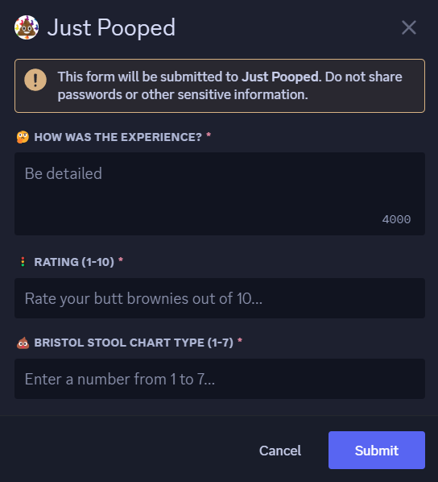
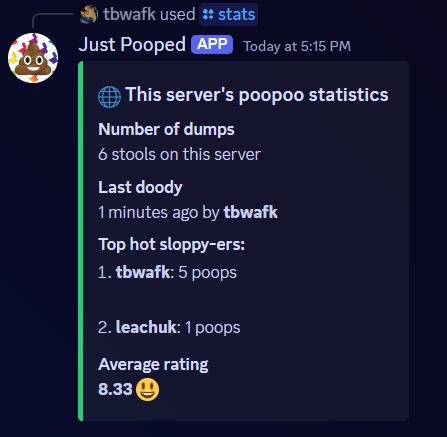
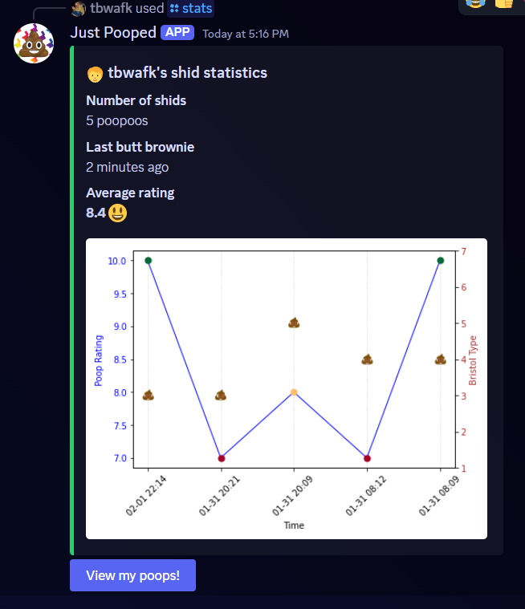
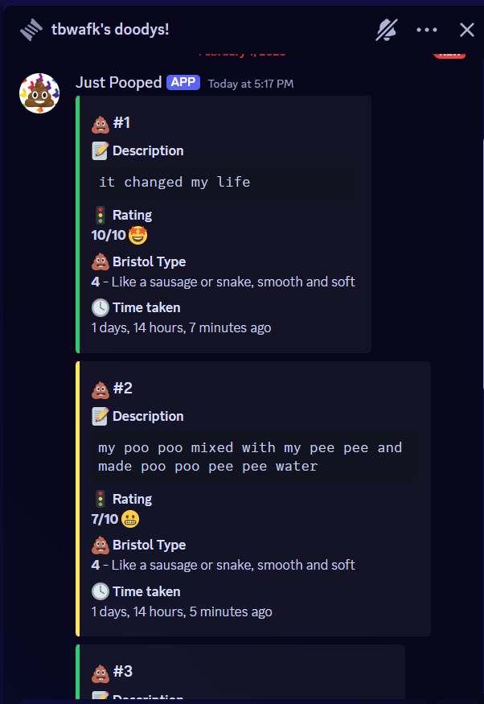
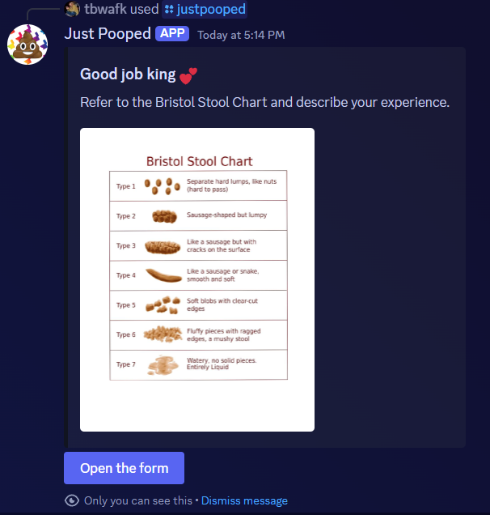
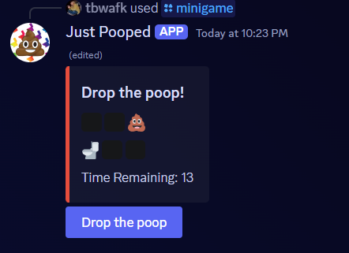
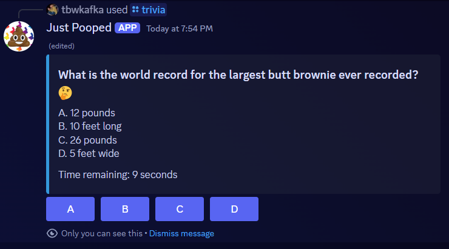
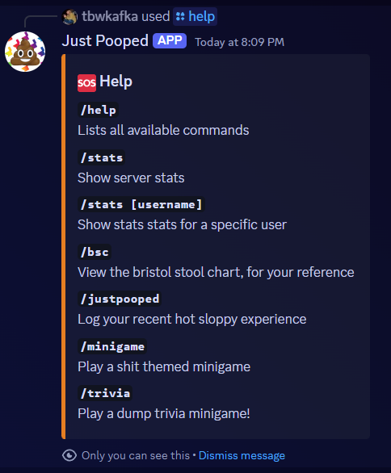

<p align="center">
    
</p>
<h2 align="center">JustPooped-Discord-Bot</h2>
<p align="center">
    A Discord bot written in Python that tracks your servers bathroom habits, minigame and trivia included!
</p>
<h4>Table of contents</h4>
<ul>
    <li><a href='#commands'>Commands</a></li>
    <li><a href='#setup'>Setup</a></li>
    <li><a href='#todo'>TODO</a></li>
    <li><a href='#supported-languages'>Supported Languages</a></li>
    <li><a href='#contribution'>Contribution</a></li>
</ul>
<hr>
<h4 id='commands'>Commands</h4>
<table>
    <tr>
        <th>Command</th>
        <th>Description</th>
        <th>Image</th>
    </tr>
    <tr>
        <td><code>/justpooped</code></td>
        <td>Log your latest bathroom excursion experience.</td>
        <td></td>
    </tr>
    <tr>
        <td><code>/stats</code></td>
        <td>Show server statistics</td>
        <td></td>
    </tr>
    <tr>
        <td><code>/stats [username]</code></td>
        <td>Show stats stats for a specific user.</td>
        <td></td>
    </tr>
    <tr>
        <td><code>^^ Button press:</code> View all logs</td>
        <td>Creates a thread.</td>
        <td></td>
    </tr>
    <tr>
        <td><code>/bsc</code></td>
        <td>View the bristol stool chart, for your reference</td>
        <td></td>
    </tr>
    <tr>
        <td><code>/minigame</code></td>
        <td>Drop the poop in the toilet before the time runs out</td>
        <td></td>
    </tr>
    <tr>
        <td><code>/trivia</code></td>
        <td>Answer an on-theme trivia question before the time runs out</td>
        <td></td>
    </tr>
    <tr>
        <td><code>/help</code></td>
        <td>Lists all available commands</td>
        <td></td>
    </tr>
</table>
<hr>
<h4 id='setup'>Setup</h4>
<ul>
    <li>Add the token from <code>Settings > Bot > Token</code> to the <code>TOKEN=</code> line of config.py.</li>
    <li>Under <code>Settings > Bot > Privileged Gateway Intents</code> turn on the following:
        <ul>
            <li>Presence Intent</li>
            <li>Message Content Intent</li>
        </ul>
    </li>
    <li>Under <code>Settings > Installation > Default Install Settings > Guild Install</code> set the following:
        <ul>
            <li>Scopes: <code>applications.commands</code>, <code>bot</code>.</li>
            <li>Permissions: <code>Read Message History</code>, <code>Send Messages</code>, <code>Use Slash Commands</code>, <code>Create Private Threads</code>, <code>Create Public Threads</code></li>
        </ul>
    <li>You can turn off <code>Public Bot</code> under <code>Settings > Bot > Public Bot</code>.
</ul>
<hr>
<h4 id='todo'>TODO</h4>
<ul>
    <li><strike>Set up and publish a docker container, for easy install.</strike></li>
    <li>Implement i8ln, add translations for French and Spanish.</li>
</ul>
<hr>
<h4 id='supported-languages'>Supported Languages</h4>

| Language  | Code | Translation accuracy                |
|-----------|------|-------------------------------------|
| English   |``` en ```| Native                          |
| Spanish   |``` es ```| **TODO** |
| French    |``` fr ```| **TODO** |
<p>Help me translate to as many languages as possible, submit your PR!</p>
<hr>
<h4 id='contribution'>Contribution</h4>
<p>Contribution is welcome! New features, bug fixes, internationalization. Submit your pull requests, thanks!</p>


